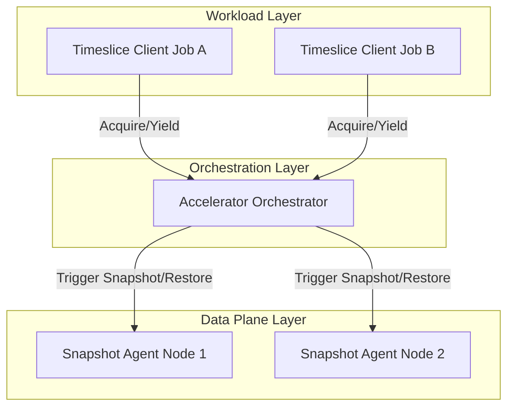

# Accelerator Orchestrator

The Accelerator Orchestrator is the central coordination brain of the Time-Slicing platform. It manages cooperative lock queues across multi-tenant RL workloads and orchestrates accelerator memory snapshot and restore operations across distributed nodes.

By coordinating access to shared accelerator pools, it enables RL workloads to eliminate the "stop-and-wait" inefficiency in Reinforcement Learning (RL) loops, greatly improving accelerator duty cycles.

## Concepts & Architecture

### Use Cases

1.  **Cooperative RL Job Interleaving:** Interleave independent RL jobs on shared GPU/TPU pools (e.g., Job B samples while Job A trains) to maximize utilization.
2.  **Multi-tenant Resource Sharing:** Manage fair sharing of accelerator pools across teams/experiments without manual coordination or OOM risks.

### Orchestrator Overview

The Accelerator Orchestrator runs as a cluster-level service. It:
- **Manages Lock Queues:** Maintains a First-In, First-Out (FIFO) lock queue for each accelerator pool to ensure orderly access.
- **Orchestrates Swaps:** Coordinates with node-local [Snapshot Agents](../snapshot-agent/README.md) to atomically evict (snapshot) the yielding job's accelerator memory and restore the next pending job's accelerator memory.

### Key Concepts

- **Job:** Represents a single workload (e.g., `job-a`). A job is a collective unit that uses multiple pods (such as sampler and trainer pods).
  - **Accelerator Work Pod** (or **work pod**): Represents a pod that uses accelerator(s) to do work for a Job.
- **Group:** Represents a named pool of shared physical accelerator resources (e.g., `group-ab-sampler`). Multiple Jobs can contend for access to the same Group. The orchestrator enforces mutual exclusion within a Group, ensuring that only one Job's pods are loaded in accelerator memory across all pool accelerator resources at any time.

### Architecture & Flow

The Time-Slicing platform is divided into three operational layers:

1.  **Workload-Scoped Layer (Application):** The RL loop code uses the `TimesliceClient` to signal phase boundaries via `acquire()` and `yield()`.
2.  **Cluster-Scoped Layer (Orchestration):** The **Accelerator Orchestrator** manages the lock queues and coordinates the node-level swaps.
3.  **Node-Scoped Layer (Data Plane):** The [Snapshot Agent](../snapshot-agent/README.md) DaemonSet executes the physical memory snapshot/restore on the hardware.



#### How it Works (End-to-End Flow)

1.  **Acquire:** Job A reaches a work boundary (e.g., entering a training step, beginning rollout/sampling phase) and calls `acquire()`, blocking until granted.
2.  **Wait:** If another job (Job B) holds the lock, Job A enters a FIFO queue and waits till it gets the lock.
3.  **Evict (Snapshot):** When Job B calls `yield()`, the Orchestrator instructs the Snapshot Agent to save Job B's accelerator memory to host DRAM.
4.  **Restore:** The Orchestrator instructs the Agent to restore Job A's saved state from host DRAM to accelerator memory.
5.  **Resume:** The Orchestrator grants the lock, unblocking Job A to resume execution.

---

## Deploying the Accelerator Orchestrator

The Accelerator Orchestrator is deployed as a standard Kubernetes Deployment, typically in the `timeslice-system` namespace.

### Cluster Prerequisites
To enable time-slicing, the cluster must be configured with:
- **Kubernetes Version:** 1.32 or later (required for DRA).
- **At least one GPU node with:**
  - **NVIDIA Driver:** 565 or later (required for DRA Driver).
  - **Labels & Taints:** `timeslice.io/enabled=true` and tainted with `timeslice.io/shared=true:NoSchedule` to isolate time-slicing workloads.
  - **Group Labels:** `group.timeslice.io/<group-id>=true` (e.g., `group.timeslice.io/group-ab-sampler=true`) to schedule grouped pods together.
- **Deployment Ordering:** Nodes for a group must be active and labeled **before** workloads attempt to acquire the lock. The orchestrator uses these labels for topology discovery; for now, empty groups cannot be managed.

### Installation via Helm
The Accelerator Orchestrator is co-deployed with the Snapshot Agent using the parent Timeslice Helm chart.

Refer to the parent deployment guide in [deploy/README.md](../../deploy/README.md) for detailed instructions on deploying the entire platform.

## Integrating Accelerator Work Pods & Jobs

### Accelerator Work Pod Configuration (YAML)

Pods opt-in to time-slicing via pod labels.

#### Required Labels
- `timeslice.io/job-id: "<unique-job-id>"`: Identifies which job the pod belongs to (e.g., `job-a`).
- `timeslice.io/group: "<group-id>"`: Identifies the Group the pod contends for (e.g., `group-ab-sampler` or `group-ab-trainer`). Pods with the same Group label share a lock queue.

#### DRA Resource Claims
To share physical accelerators, workloads must request accelerators via Kubernetes **Dynamic Resource Allocation (DRA)** `ResourceClaim`s instead of traditional exclusive `resources.limits`. Define a `ResourceClaim` matching the accelerator count your pods need, and reference it in your pod spec.

##### Define the ResourceClaim
Create a `ResourceClaim` manifest specifying the required GPU count (e.g., 2 GPUs):

```yaml
apiVersion: resource.k8s.io/v1
kind: ResourceClaim
metadata:
  name: shared-two-gpus-claim
spec:
  devices:
    requests:
    - name: double-gpus
      deviceClassName: gpu.nvidia.com # TODO: update this with our deployed device class
      allocationMode: ExactCount
      count: 2 # Number of GPUs needed
```

##### Reference the Claim in the Pod Spec
Configure your accelerator workload pod to use the `ResourceClaim`:

```yaml
spec:
  containers:
  - name: my-container
    resources:
      claims:
      - name: accelerator # Must match the name in resourceClaims below
  resourceClaims:
  - name: accelerator
    resourceClaimName: shared-two-gpus-claim # References the ResourceClaim above
```

#### Required Node Selectors & Tolerations

To ensure work pods are scheduled on the correct isolated accelerator nodes, you must configure both `nodeSelector` and `tolerations` in the pod specification.

##### Node Selectors
Work pods must target nodes that are enabled for time-slicing and belong to their specific resource Group:

```yaml
spec:
  nodeSelector:
    group.timeslice.io/group-ab-sampler: "true" # Matches the node Group label
```

##### Tolerations
Because time-slicing nodes are tainted to prevent regular workloads from scheduling on them, work pods must explicitly tolerate the time-slicing taint:

```yaml
spec:
  tolerations:
  - key: "timeslice.io/shared"
    operator: "Equal"
    value: "true"
    effect: "NoSchedule"
```

#### Complete Pod Configuration Example

Here is a complete example of a Pod manifest incorporating all the required configuration elements:

```yaml
apiVersion: v1
kind: Pod
metadata:
  name: my-accelerator-work-pod
  labels:
    timeslice.io/job-id: "job-a"
    timeslice.io/group: "group-ab-sampler"
spec:
  containers:
  - name: workload-container
    image: my-workload-image:latest
    resources:
      claims:
      - name: accelerator
  resourceClaims:
  - name: accelerator
    resourceClaimName: shared-two-gpus-claim # References an external ResourceClaim
  nodeSelector:
    group.timeslice.io/group-ab-sampler: "true" # Matches the node Group label
  tolerations:
  - key: "timeslice.io/shared"
    operator: "Equal"
    value: "true"
    effect: "NoSchedule"
```

### Job Logic & Orchestration (Code)

#### Pattern A: Accelerator Work Pod Deployment (Startup)
When running time-sliced jobs, work pods must only be deployed and scheduled onto the accelerator nodes while their job holds the lock for their respective Group. 

Typically, you configure a central coordinator (such as the RL loop actor in init) to:
1.  Acquire the Group lock first.
2.  Deploy the work pods only after the lock is successfully granted.
3.  Yield the lock.

This ordering prevents resource conflicts during the initial startup and initialization phases.

* Note: The Python client library for the Accelerator Orchestrator is currently under development (TBD). Example code will appear after implementation.

#### Pattern B: Job Logic Execution (Run-time)
A job's logic covers triggering work to be done on deployed work pods.

Typically, you configure the job logic (such as the RL loop actor in the loop) to:
1.  Acquire the Group lock first.
2.  Send work to the work pods.
3.  Once work is done and the accelerator is not needed, yield the lock.

* Note: The Python client library for the Accelerator Orchestrator is currently under development (TBD). Example code will appear after implementation.

---

## Monitoring & Troubleshooting

### Debugging with `rlts` CLI

Use the `rlts` CLI to interact with and debug the Accelerator Orchestrator.

#### Port-Forwarding to the Orchestrator
Port-forward to the service (default port `50051`) if running locally:
```bash
kubectl port-forward svc/acceleratororchestrator 50051:50051
```

#### Common Commands

*   **List Active Groups:** View all active time-slice groups.
    ```bash
    rlts orchestrator list
    ```

*   **Get Group Status:** Inspect detailed group status (lock holder, waiters, agent states).
    ```bash
    rlts orchestrator status <group-id>
    ```

*   **Manual Acquire:** Request the lock for a job (blocks until granted).
    ```bash
    rlts orchestrator acquire <group-id> <job-id>
    ```

*   **Manual Yield:** Force-release a lock to unblock a hung queue.
    ```bash
    rlts orchestrator yield <group-id> <job-id>
    ```

### Metrics
* Note: Currently under development (TBD).
